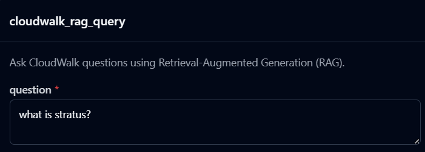
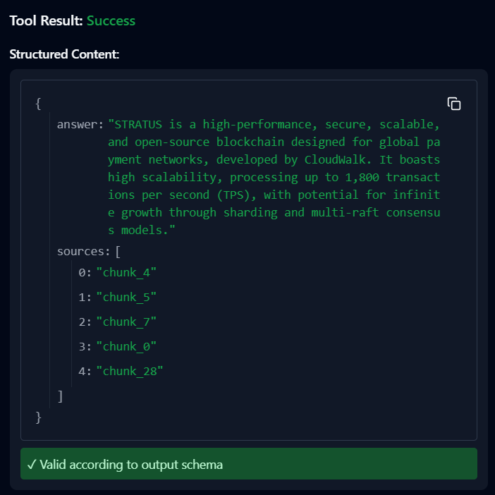

# CloudWalk Bot

A Retrieval-Augmented Generation (RAG) assistant designed to answer questions about **CloudWalk** and **InfinitePay** services. This project scrapes official documentation, processes the data into a vector index, and serves answers via a Web UI or a Model Context Protocol (MCP) server.

##  Features

* **Automated Pipeline**: Scrapes, cleans, chunks, and embeds data from CloudWalk and InfinitePay websites.
* **RAG Architecture**: Uses a Vector Store (FAISS) to retrieve relevant context for accurate answers.
* **Dual Interfaces**:
    * **Web UI**: A FastAPI-based chat interface.
    * **MCP Server**: Compliant with the Model Context Protocol for integration with AI assistants (like Claude Desktop).
* **LLM Integration**: Supports Groq and OpenRouter for fast inference and embeddings.

##  Project Structure

```text
cloudwalk-bot/
├── app/
│   ├── config.py             # Configuration & Environment variables
│   ├── mcp_server.py         # MCP Server entry point
│   ├── web_server.py         # FastAPI Web Server entry point
│   ├── pipeline/             # ETL Pipeline
│   │   ├── build_index.py    # Main script to run the pipeline
│   │   ├── scraper.py        # Web scraper logic
│   │   ├── cleaner.py        # Text cleaning logic
│   │   └── chunker.py        # Text chunking logic
│   ├── rag/                  # RAG Core Logic
│   │   ├── embedder.py       # Embedding generation
│   │   ├── generator.py      # LLM answer generation
│   │   ├── retriever.py      # Vector retrieval logic
│   │   ├── vectorstore.py    # FAISS wrapper
│   │   └── rag_query_engine.py # Main query logic
│   └── utils/
│       └── file_io.py        # File handling utilities
├── data/
│   ├── raw/                  # Scraped raw text files
│   ├── cleaned/              # Processed text files
│   └── vectorstore/          # FAISS index and metadata
├── ui/                       # Frontend assets
│   ├── index.html
│   ├── script.js
│   └── styles.css
└── .env                      # API Keys (not committed)
```

## ️ Prerequisites

* **Python 3.11+**
* **API Keys for:**
    * **Groq** (for fast inference)
    * **OpenRouter** (optional/alternative)

##  Installation

1.  **Clone the repository:**
    ```bash
    git clone https://github.com/thummar05/cloudwalk-bot
    cd cloudwalk-bot
    ```

2.  **Create a Virtual Environment:**
    ```bash
    python -m venv venv
    source venv/bin/activate  # On Windows: venv\Scripts\activate
    ```

3.  **Install Dependencies:**
    (Note: Create a `requirements.txt` with the following if not present)
    ```bash
    pip install fastapi uvicorn fastmcp python-dotenv numpy faiss-cpu requests beautifulsoup4
    ```

4.  **Configuration:**
    Create a `.env` file in the root directory:
    ```env
    GROQ_API_KEY=your_groq_api_key_here
    OPENROUTER_API_KEY=your_openrouter_api_key_here
    ```

## Usage

### 1. Build the Knowledge Base (Pipeline)

Before running the bot, you must scrape the data and build the vector index.

```bash
# Run the pipeline module
python -m app.pipeline.build_index
```

##  Prerequisites
- Python 3.11+
- API Keys for:
  - Groq (for fast inference)
  - OpenRouter

## Installation

### 1. Clone the repository
```bash
git clone <repository-url>
cd cloudwalk-bot
```

### 2. Create a Virtual Environment
```bash
python -m venv venv
source venv/bin/activate     # macOS/Linux
# On Windows:
# venv\Scripts\activate
```

### 3. Install Dependencies
```bash
pip install fastapi uvicorn fastmcp python-dotenv numpy faiss-cpu requests beautifulsoup4
```

### 4. Configuration
Create a `.env` file in the project root:

```env
GROQ_API_KEY=your_groq_api_key_here
OPENROUTER_API_KEY=your_openrouter_api_key_here
```

## Usage

### 1. Build the Knowledge Base (Pipeline)
```bash
python -m app.pipeline.build_index
```

### 2. Run the Web Server (Chat UI)
```bash
python -m app.web_server
```

UI: http://localhost:3000  
API: POST http://localhost:3000/api/chat

### 3. Run the MCP Server
```bash
python -m app.mcp_server
```

Tool Name: cloudwalk_rag_query  
Description: Ask CloudWalk questions using Retrieval-Augmented Generation.


### Example input:



### Example output:


